# Product Hands-on Lab - Use Azure Communication Services to extend the capabilities of your applications

Welcome to this Azure Communication Services Workshop. You will learn how to integrate Azure Communication Services with Microsoft Teams to build a chat application. Don't worry, even if the challenges will increase in difficulty, this is a step by step lab, you will be guided through the whole process.

During this workshop you will have the instructions to complete each steps. It is recommended to search for the answers in provided resources and links before looking at the solutions placed under the 'Toggle solution' panel.

<div class="task" data-title="Task">

> You will find the instructions and expected configurations for each Lab step in these yellow **TASK** boxes.
>
> Inputs and parameters to select will be defined, all the rest can remain as default as it has no impact on the scenario.

</div>

## Naming conventions

Before starting to deploy any resource in Azure, it's important to follow a naming convention to ensure resource name uniqueness and ease their identification. Based on the official [documentation][az-naming-convention] you need to define a few things:

- The application name
- The environment
- The region
- The instance number

You will also add an owner property, so for the purpose of this lab the values will be:

- The service prefix: `acs` (for Azure Communication Services)
- The environment: `dev`
- The region: `we` (for West Europe)
- The application name: `hol` (for Hands On Lab)
- The owner: `ms`
- The instance: `01`

You will use this convention for the rest of the scenario:

```xml
<!--If the resource prefix has a dash: -->
<service-prefix>-<environment>-<region>-<application-name>-<owner>-<instance>
<!--If the resource does not autorize any special caracters: -->
<service-prefix><environment><region><application-name><owner><instance>
```

<div class="info" data-title="Note">

> Be sure to use **your own values** to have unique names or use your own convention.
> [Official resource abbreviations][az-abrevation]
>
> Some services like Azure Storage Account or Azure KeyVault have a maximum size of 24 characters, so please consider using relevant abbreviations as small as possible.

</div>

## Dev Environment Setup

To retrieve the lab content :

- A Github account (Free, Team or Enterprise)
- Create a [fork][Repo-fork] of the repository from the **main** branch to help you keep track of your changes

3 development options are available:

- _Preferred method_ : Pre-configured GitHub Codespace
- Local Devcontainer
- Local Dev Environment with all the prerequisites detailed below

<div class="tip" data-title="Tips">

> To focus on the main purpose of the lab, we encourage the usage of devcontainers/codespace as they abstract the dev environment configuration, and avoid potential local dependencies conflict.
>
> You could decide to run everything without relying on a devcontainer : To do so, make sure you install all the prerequisites detailed below.

</div>

### Pre-configured GitHub Codespace

To use a Github Codespace, you will need :

- [A GitHub Account][github-account]

Github Codespace offers the ability to run a complete dev environment (Visual Studio Code, Extensions, Tools, Secure port forwarding etc.) on a dedicated virtual machine.
The configuration for the environment is defined in the `.devcontainer` folder, making sure everyone gets to develop and practice on identical environments : No more conflict on dependencies or missing tools !

Every Github account (even the free ones) grants access to 120 vcpu hours per month, _**for free**_. A 2 vcpu dedicated environment is enough for the purpose of the lab, meaning you could run such environment for 60 hours a month at no cost!

To get your codespace ready for the labs, here are a few steps to execute :

- After you forked the repo, click on `<> Code`, `Codespaces` tab and then click on the `+` button:


- You can also provision a beefier configuration by defining creation options and select the **Machine Type** you like :


### Using a local Devcontainer

This repo comes with a Devcontainer configuration that will let you open a fully configured dev environment from your local Visual Studio Code, while still being completely isolated from the rest of your local machine configuration : No more dependancy conflict.
Here are the required tools to do so :

- [Git client][git-client]
- [Docker Desktop][docker-desktop] running
- [Visual Studio Code][vs-code] installed

Open the local repository you just cloned or forked in Visual Studio Code. Make sure Docker Desktop is up and running and open the cloned repository in Visual Studio Code.

You will be prompted to open the project in a Dev Container. Click on `Reopen in Container`.

If you are not prompted by Visual Studio Code, you can open the command palette (`Ctrl + Shift + P`) and search for `Reopen in Container` and select it:


### Using your own local environment

The following tools and access will be necessary to run the lab in good conditions on a local environment :

- [Git client][git-client]
- [Visual Studio Code][vs-code] installed (you will use Dev Containers)
- [Node 22][download-node]
- Npm 10

Once you have set up your local environment, you can clone the Hands-on-lab repository you just forked on your machine, and open the local folder in Visual Studio Code and head to the next step.

## Sign in to Azure

Before starting this lab, be sure to set your Azure environment :

- An Azure Subscription with the **Contributor** role to create and manage the labs' resources
- A dedicated resource group for this lab to ease the cleanup at the end.
- Register the Azure providers on your Azure Subscription if not done yet: `Microsoft.Communication`.

<div class="task" data-title="Task">

> - Log into your Azure subscription in your environment using Azure CLI and on the [Azure Portal][az-portal] using your credentials.
> - Instructions and solutions will be given for the Azure CLI, but you can also use the Azure Portal if you prefer.
> - Register the Azure providers on your Azure Subscription if not done yet: `Microsoft.Communication`

</div>

<details>

<summary>Toggle solution</summary>

```bash
# Login to Azure :
# --tenant : Optional | In case your Azure account has access to multiple tenants

# Option 1 : Local Environment
az login --tenant <yourtenantid or domain.com>
# Option 2 : Github Codespace : you might need to specify --use-device-code parameter to ease the az cli authentication process
az login --use-device-code --tenant <yourtenantid or domain.com>

# Display your account details
az account show
# Select your Azure subscription
az account set --subscription <subscription-id>

# Register the following Azure providers if they are not already

# Azure Communication Services
az provider register --namespace 'Microsoft.Communication'
```

</details>

## Create an Azure Communication Services resource

In this lab, you will create an Azure Communication Services resource to enable communication capabilities in your application.

<div class="task" data-title="Task">

> Create an Azure Communication Services resource in your Azure subscription.
> The naming convention for an Azure Communication Service is: `acs-<environment>-<region>-<application-name>-<owner>-<instance>`

</div>

<details>
<summary>Toggle solution</summary>

Go to the Azure Portal and create a new resource by searching for `Azure Communication Services`.

Make sure to select the right subscription and resource group or create one, and choose a unique name for your Azure Communication Service resource. You can pick a location close to you or your users.

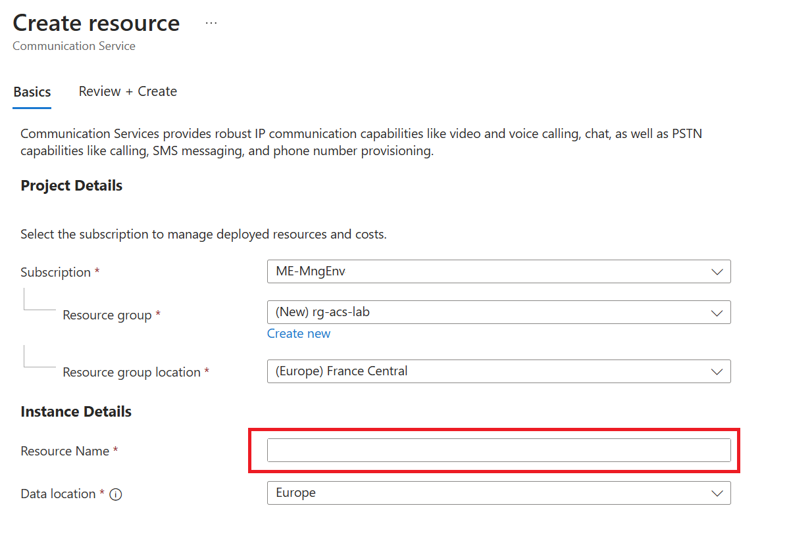

Click on `Review + create`.

</details>

[az-cli-install]: https://learn.microsoft.com/en-us/cli/azure/install-azure-cli
[az-naming-convention]: https://learn.microsoft.com/en-us/azure/cloud-adoption-framework/ready/azure-best-practices/resource-naming
[az-abrevation]: https://learn.microsoft.com/en-us/azure/cloud-adoption-framework/ready/azure-best-practices/resource-abbreviations
[az-portal]: https://portal.azure.com
[vs-code]: https://code.visualstudio.com/
[docker-desktop]: https://www.docker.com/products/docker-desktop/
[Repo-fork]: https://github.com/microsoft/hands-on-lab-acs-teams/fork
[git-client]: https://git-scm.com/downloads
[github-account]: https://github.com/join
[download-node]: https://nodejs.org/en

---

# Lab 1 - Create a call between two ACS users

In this lab, you will create a call between two users using Azure Communication Services. This will be the base to understand how Azure Communication Services works. In the next labs, you will use Azure Communication Services in an architecture closed to a real world scenario.

## Scenario

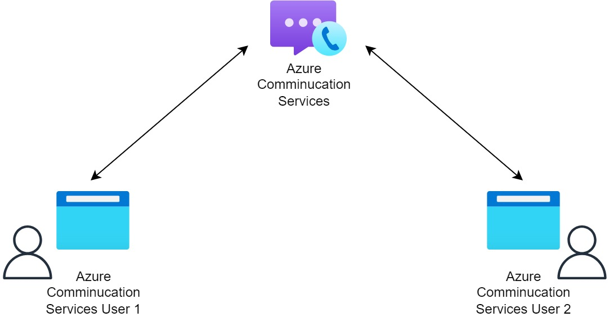

To start this lab you will use the code inside `src/add-1-on-1-acs`. The goal of this lab is to be able to start 2 instances of the frontend application and create a call between them.

To do so, you will implement the call and video methods in the frontend application. Everything is already set up for you, you just need to implement the methods inside the `src/add-1-on-1-acs/index.js` file.

The initialisation of the call agent is already done for you, you can look at it in the `src/add-1-on-1-acs/index.js` file inside the `initializeCallAgentButton.onclick` method.

This is done in 3 steps:

- Initialize Azure Communication Services with the creation of a call agent based on an user access token that you will get from the Azure Communication Services resource
- Initialize the camera and microphone to use in the call
- Listen for an incoming call to accept it

## Start a call

The first step is to create a call between two Azure Communication Services users.

<div class="task" data-title="Task">

> - Implement the `startCallButton.onclick` method to create a call between two users. Use the predefined `createLocalVideoStream` method to create a local video stream.
> - The `calleeAcsUserId` is the user identifier of the person you want to call which is retrieved from an input field.
> - Don't forget to subscribe to the call's properties and events using the `subscribeToCall` method predefined for you.

</div>

<div class="tip" data-title="Tips">

> You can find how to start a call between two users in this [tutorial][acs-start-call]

</div>

<details>
<summary>Toggle solution</summary>

The `startCallButton.onclick` method should look like this:

```javascript
startCallButton.onclick = async () => {
  try {
    const localVideoStream = await createLocalVideoStream();
    const videoOptions = localVideoStream
      ? { localVideoStreams: [localVideoStream] }
      : undefined;
    call = callAgent.startCall(
      [{ communicationUserId: calleeAcsUserId.value.trim() }],
      { videoOptions }
    );
    // Subscribe to the call's properties and events.
    subscribeToCall(call);
  } catch (error) {
    console.error(error);
  }
};
```

The first step inside the try block is to create a local video stream by calling the `createLocalVideoStream` function and awaiting its result. This function likely initializes the user's webcam and microphone and returns a stream object.

Next, the code checks if the `localVideoStream` was successfully created. If it was, it constructs a videoOptions object containing the local video stream. If not, videoOptions is set to undefined.

The `callAgent.startCall` method is then called to initiate a call. The `communicationUserId` is the identifier of the person being called, which is retrieved from an input field (`calleeAcsUserId`) and trimmed of any extraneous whitespace.

After starting the call, the `subscribeToCall` function is called to set up event listeners and handlers to manage the call's properties and events, such as connection status changes or incoming media streams.

</details>

## Accept a call

Now that you have implemented the way to start a call, you now need to implement the way to accept a call. This is done by implementing the `acceptCallButton.onclick` method.

<div class="task" data-title="Task">

> - Implement the `acceptCallButton.onclick` method to accept a call from another user, using the predefined `createLocalVideoStream` method to create a local video stream.
> - Don't forget to subscribe to the call's properties and events using the `subscribeToCall` method predefined for you.

</div>

<div class="tip" data-title="Tips">

> You can find how to receive a call from another user in this [tutorial][acs-receive-call]

</div>

<details>
<summary>Toggle solution</summary>

The `acceptCallButton.onclick` method should look like this:

```javascript
acceptCallButton.onclick = async () => {
  try {
    const localVideoStream = await createLocalVideoStream();
    const videoOptions = localVideoStream
      ? { localVideoStreams: [localVideoStream] }
      : undefined;
    call = await incomingCall.accept({ videoOptions });
    // Subscribe to the call's properties and events.
    subscribeToCall(call);
  } catch (error) {
    console.error(error);
  }
};
```

The `acceptCallButton.onclick` method is similar to the `startCallButton.onclick` method. It begins by creating a local video stream using the `createLocalVideoStream` function and awaiting its result. The videoOptions object is then constructed based on whether the local video stream was successfully created.

The important difference is that the `accept` method is called on the `incomingCall` object to accept the incoming call. The `videoOptions` object is passed as an argument to the `accept` method to specify the local video stream to be used in the call.

</details>

## Hang up a call

The last step is to implement the way to hang up a call. This is done by implementing the `hangUpCallButton.addEventListener` method.

<div class="task" data-title="Task">

> Implement the `hangUpCallButton.addEventListener` method to hang up a call.

</div>

<div class="tip" data-title="Tips">

> You can find how to end a call in this [documentation][acs-hang-up-call]

</div>

<details>
<summary>Toggle solution</summary>

The `hangUpCallButton.addEventListener` method should look like this:

```javascript
hangUpCallButton.addEventListener("click", async () => {
  // end the current call
  await call.hangUp();
});
```

The `hangUpCallButton.addEventListener` method is an event listener that listens for a click event on the `hangUpCallButton` element. When the button is clicked, the `hangUp` method is called on the `call` object to end the current call.

</details>

## Test the call

Let's test the call now. You have to start the frontend twice to simulate two users. You can do this by running the following commands:

In a first terminal:

```bash
cd src/add-1-on-1-acs

npm install

npm run start:user1
```

in a second terminal:

```bash
cd src/add-1-on-1-acs

npm run start:user2
```

This will expose two different ports for the two users:

- `localhost:8082` for the first user
- `localhost:8083` for the second user

Now, you have to go on your Azure Communication Services resource and get one `User access token` for each users. You can do this by going to the **Identities & User Access Tokens** tab, select `VOIP` and `Chat` and clicking on the `Generate` button for each user.

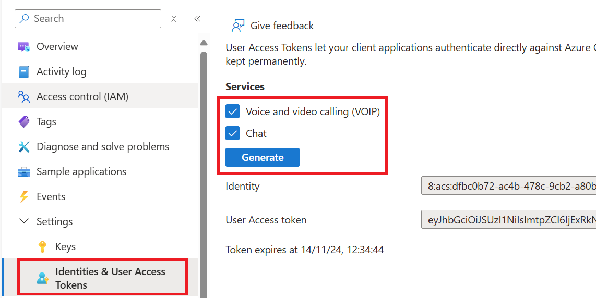

So, in the first user interface, you will have to enter his own acces token from the `User access token` field and the `Identity` field from the second user. And in the second user interface, you will have to enter his own acces token from the `User access token` field only. Then click on the `Initialize Call Agent` for both users.

So for user 1 you will have:
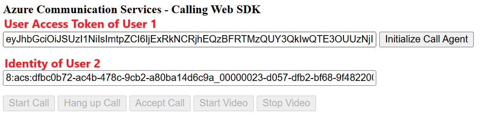

and for user 2:
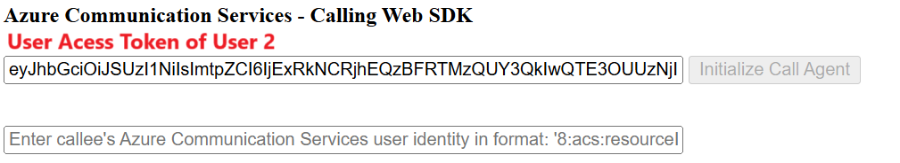

With this setup, the user 1 will use the `Identity` of the user 2 to do the call to the user 2. The `User access token` is used to authenticate the users to the Azure Communication Services.

Finally in the first user interface, you can click on the `Start Call` button and in the second user interface, you can click on the `Accept Call` button.

You should be able to see you and the other user in the video call.

## Summary Lab 1

In this lab, you have learned how to create a call between two users using Azure Communication Services. You have implemented the way to start a call, accept a call and hang up a call. You have also learned how to use the user access token to authenticate the users to the Azure Communication Services.

[acs-start-call]: https://learn.microsoft.com/en-us/azure/communication-services/how-tos/calling-sdk/manage-calls?pivots=platform-web#place-a-call
[acs-receive-call]: https://learn.microsoft.com/en-us/azure/communication-services/how-tos/calling-sdk/manage-calls?pivots=platform-web#receive-an-incoming-call
[acs-hang-up-call]: https://learn.microsoft.com/en-us/javascript/api/azure-communication-services/@azure/communication-calling/call?view=azure-communication-services-js#@azure-communication-calling-call-hangup

---

# Lab 2 - Interact with Azure Communication Services and Microsoft Teams

In this lab, you will create a real world scenario where you have a backend that interacts with Azure Communication Services and a frontend.

## Scenario

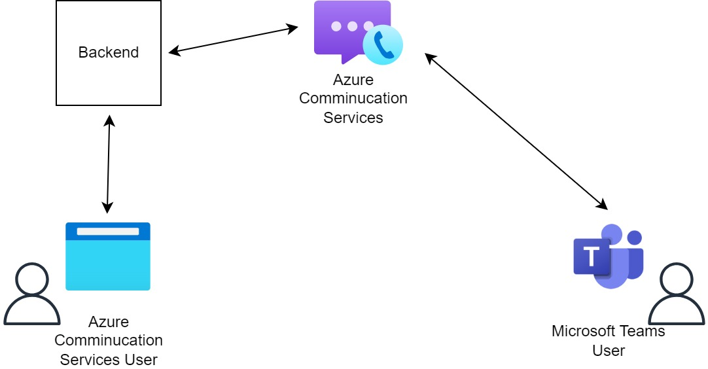

The frontend user will be able to join a Teams meeting call, send messages in a chat and use the video call feature. The backend will be responsible to create the chat and the call between the frontend and Azure Communication Services.

To start this lab you will use the code inside `src/acs-to-external`.

## Prepare the backend server

The role of the server is to interract with Azure Communication Services to create a chat, a call or a video call. The server will also be responsible to create authentification for users and provide Azure Communication Services endpoint.

### Add the Azure Communication Services connection string

Inside the `src/acs-to-external/back` folder, you will find a `.env.example` file. Rename this file to `.env` and fill in the `ACS_CONNECTION_STRING` with the connection string of your Azure Communication Services resource.

You can find it in **Settings** > **Keys** tab of your Azure Communication Services resource:

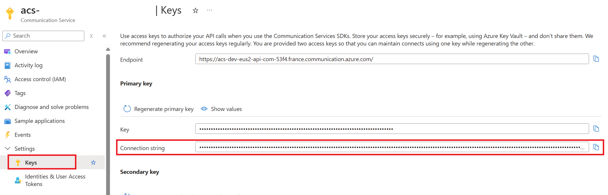

### Provide user token

Inside the `src/acs-to-external/back/svc` folder, you will find a `createUserAndToken.js` file. This file contains a method to create a user access token for chat and VOIP.

The goal of this method is to create an equivalent of the processed you did in the first lab to create a user access token inside the **Identities & User Access Tokens** tab of the Azure Communication Services resource. By calling this method, you will be able to create a user access token for chat and VOIP.

<div class="task" data-title="Task">

> Implement the `createUserAndToken` method to create a user access token for chat and VOIP.
> Test it with Postman or any other API client.

</div>

<div class="tip" data-title="Tips">

> You can find how to create a user access token in this [documentation][acs-user-access-token]

</div>

<details>
<summary>Toggle solution</summary>

To achieve this, you will need to use the `@azure/communication-identity` package.

```javascript
export async function createUserAndToken(scopes) {
  const client = new CommunicationIdentityClient(env["ACS_CONNECTION_STRING"]);
  return client.createUserAndToken(scopes);
}
```

</details>

### Test the method

You can now start the server by running the following commands:

```bash
cd src/acs-to-external/back

npm install

npm start
```

To check if the server is running, you can go to `http://localhost:8080` in your browser and try to call the `/getEndpointUrl` endpoint which is defined in the `src/acs-to-external/back/app.js` file.

## Prepare the frontend

Now that you have a backend server running, you can create a chat between two users. In this lab you will create a chat between an Azure Communication Services user and a Microsoft Teams user.

You can find the frontend code of a basic chat inside the `src/acs-to-external/front` folder. The frontend is a simple HTML page with a chat box and a form to send messages.

The next step is to connect the frontend to the backend.

<div class="task" data-title="Task">

> Inside the `src/acs-to-external/front/client.js` file, implement the `main` method to create a `callClient`, `callAgent` and `chatClient` objects.
> Use the methods inside the `src/acs-to-external/front/utils` folder in the `utils.js` file to initiate those objects.

</div>

<div class="tip" data-title="Tips">

> You can find how to create a callClient, callAgent and chatClient in this [documentation][acs-client]

</div>

<details>
<summary>Toggle solution</summary>

The `main` method should look like this:

```javascript
async function main() {
  const callClient = new CallClient();
  const creds = new AzureCommunicationTokenCredential(await getToken());

  const callAgent = await callClient.createCallAgent(creds, {
    displayName: "ACS user",
  });
  const chatClient = new ChatClient(await getEndpointUrl(), creds);

  const deviceManager = await callClient.getDeviceManager();
  await deviceManager.askDevicePermission({ video: true, audio: true });
  await registerEvents(callAgent, chatClient, deviceManager);
}
```

The `callClient` is responsible of creating the connection between an Azure Communication Services and your frontend.
The `callAgent` is responsible of creating a call between two users. The `chatClient` is responsible of creating a chat between two users.

You will use those different objects in the next steps to create a call, a video call and a chat.

</details>

## Create a call

Next step is to create a call between two users: An Azure Communication Services user and a Microsoft Teams user.

### Add the call method

The file where you will find the code to interract with the backend is `src/acs-to-external/front/client.js` file to create a call between two users.

<div class="task" data-title="Task">

> Implement the `startCall` method to create a call between two users.

</div>

<div class="tip" data-title="Tips">

> You can find how to create a call between two users in this [documentation][acs-teams-call]

</div>

<details>
<summary>Toggle solution</summary>

The `startCall` method should look like this:

```javascript
async function startCall(meetingLink, callAgent, chatClient, gui) {
  const call = await callAgent.join({ meetingLink }, {});
}
```

As you can see, the `startCall` method takes a `meetingLink` parameter, a `callAgent` object. The `meetingLink` is the link of the Teams meeting you want to join. The `callAgent` is the object that will create the call.

It's as simple as that to create a call between two users.

</details>

### Add the hangUp method

<div class="task" data-title="Task">

> Implement the `hangsUp` method to create close the call between two users.

</div>

<details>
<summary>Toggle solution</summary>

The `hangUp` method should look like this:

```javascript
async function hangsUp(callAgent, chatClient) {
  await callAgent.calls?.[0]?.hangUp();
}
```

</details>

### Test the call

Inside the `src/acs-to-external/front` folder, you will find a `.env.example` file. Rename this file to `.env` and fill in the `BACKEND_URL` with the URL of your backend server which is `http://localhost:8080` by default.

You can now start the frontend by running the following commands:

```bash
cd src/acs-to-external/front

npm install

npm start
```

To check if the frontend is running, you can go to `http://localhost:8081` in your browser.

Now you can create a Teams meeting and pass the invitation link that will start with `https://teams.microsoft.com/l/meetup-join/...`. You will be able to join the call by clicking on the `Join Teams Meeting` button.

## Create a chat

Next step is to create a chat between two users: An Azure Communication Services user and a Microsoft Teams user.

### Add / Update the chat methods

You will continue to use the code inside the `src/acs-to-external/front/client.js` file to create a chat between two users.

<div class="task" data-title="Task">

> Implement the `sendMessage` method to create a chat between two users.
> Update the `startCall` method to listen to the `chatMessageReceived` event to receive the messages of this call.
> Update the `hangsUp` method to stop the chat notifications.

</div>

<div class="tip" data-title="Tips">

> You can find how to send a message in this [documentation][acs-send-message]

</div>

<details>
<summary>Toggle solution</summary>

The `sendMessage` method should look like this:

```javascript
async function sendMessage(chatThreadClient, content) {
  await chatThreadClient.sendMessage({ content });
}
```

As you can see, the `sendMessage` method takes a `chatThreadClient` object and a `content` parameter. The `senderDisplayName` is the name of the user who sends the message.

In the `startCall` method, you will need to add a listener to the messages of this call:

```javascript
call.on("stateChanged", async () => {
  let isFirstConnection = true;
  if (call.state === "Connected" && isFirstConnection) {
    isFirstConnection = false;

    await chatClient.startRealtimeNotifications();
    chatClient.on("chatMessageReceived", (e) => {
      const isOwnMessage = e.sender.communicationUserId === "";
      gui.renderMessage(e.message, isOwnMessage);
    });
  }
});
```

As you can see, we listen to the `chatMessageReceived` event and render the message in the chat box using the `startRealtimeNotifications` method.

In the `hangsUp` method, you will also need to stop the notifications by adding the following line:

```javascript
chatClient.stopRealtimeNotifications();
```

</details>

### Test the chat

You can now start the frontend again by running the following commands:

```bash
cd src/acs-to-external/front

npm start
```

Go back to `http://localhost:8081` in your browser and once again start a Teams meeting, it can be the same one you used for the call. You will be able to send a message by clicking on the `Send` button.

## Create a video call

In this lab you will add the possibility to create a video call between two users: An Azure Communication Services user and a Microsoft Teams user.

### Add the video call methods

You will continue to use the code inside the `src/acs-to-external/front/client.js` file.

<div class="task" data-title="Task">

> Implement the `startVideo` method to create a video call between two users.
> Implement the `stopVideo` method to stop the video call.
> The access to the camera was already asked in the `main` method for you. You will just use it with the `deviceManager` object.

</div>

<div class="tip" data-title="Tips">

> To retreive the local video stream, you can use this code:
>
> ```javascript
> // Local video loopback
> localVideoStream = new LocalVideoStream(cameras[0]);
> const renderer = new VideoStreamRenderer(localVideoStream);
> gui.displayLocalVideo(renderer);
> ```

</div>

<details>
<summary>Toggle solution</summary>

The `startVideo` method should look like this:

```javascript
async function startVideo(callAgent, deviceManager, gui) {
  const cameras = await deviceManager.getCameras();
  if (cameras.length <= 0) {
    throw new Error("No camera device found on the system");
  }

  // Local video loopback
  localVideoStream = new LocalVideoStream(cameras[0]);
  const renderer = new VideoStreamRenderer(localVideoStream);
  gui.displayLocalVideo(renderer);

  // Sending video stream to remote
  const call = callAgent.calls?.[0];
  if (!call) {
    throw new Error("No call found");
  }
  await call.startVideo(localVideoStream);
}
```

The `startVideo` function is an asynchronous function designed to initialize and start a video stream using a camera device. Here's a step-by-step explanation:

- **Retrieve Cameras:** The function first retrieves a list of available camera devices using the deviceManager. This is done asynchronously.

- **Check for Cameras:** It checks if any cameras are available. If no cameras are found, it throws an error indicating that no camera device is found on the system.

- **Local Video Loopback:** If a camera is available, it creates a local video stream using the first camera in the list. It then creates a video stream renderer for this local video stream and displays it on the browser.

- **Sending Video Stream to Remote:** The function retrieves the first call from the callAgent. If no call is found, it throws an error indicating that no call is found. If a call is found, it starts sending the local video stream to the remote participant in the call.

The `stopVideo` method should look like this:

```javascript
async function stopVideo(callAgent, gui) {
  // Local video
  await gui.hideLocalVideo();

  // Stop sending video stream to remote
  const call = callAgent.calls?.[0];
  await call.stopVideo(localVideoStream);
}
```

The `stopVideo` function is an asynchronous function designed to stop the local video stream and stop sending it to a remote participant.

- **Hide Local Video**: It hides the local video stream from the GUI.
- **Stop Sending Video Stream to Remote**: It retrieves the first call from the `callAgent`. If a call is found, it stops sending the local video stream to the remote participant by calling `stopVideo` method.

</details>

### Test the video call

You can now start the frontend again by running the following commands:

```bash
cd src/acs-to-external/front

npm start
```

Go back to `http://localhost:8081` in your browser and once again start a Teams meeting, it can be the same one you used for the call. You will be able to see you in the video call by clicking on the `Start Video` button.

[acs-user-access-token]: https://learn.microsoft.com/en-us/javascript/api/overview/azure/communication-identity-readme?view=azure-node-latest#using-a-connection-string
[acs-client]: https://learn.microsoft.com/en-us/azure/communication-services/how-tos/calling-sdk/manage-calls?pivots=platform-web#initialize-required-objects
[acs-teams-call]: https://learn.microsoft.com/en-us/azure/communication-services/quickstarts/voice-video-calling/get-started-teams-interop?pivots=platform-web#enable-the-teams-ui-controls

---

# Lab 3 - Call a phone number

Now let's use the Azure Communication Services to call a phone number. In this lab, you will create a call between your frontend application and a phone number.

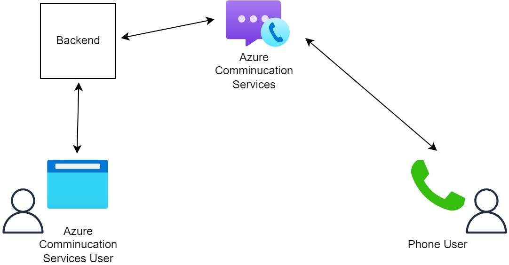

## Buy a phone number

First step is to go to the Azure Communication Services resource you created in the first lab and inside the `Phone Numbers` tab, you will need to buy a phone number.

<div class="task" data-title="Task">

> Buy a `Toll-free` phone number inside the Azure Communication Services resource.

</div>

<details>
<summary>Toggle solution</summary>

Click on the `+ Get` button to buy a new phone number. Select a country and the `Toll-free` option, then click on `Search`.

Select one of the available phone numbers and click on add `Add to cart`. Click on `Review + buy` and then `Buy`.

You should now have a phone number in the `Phone Numbers` tab:

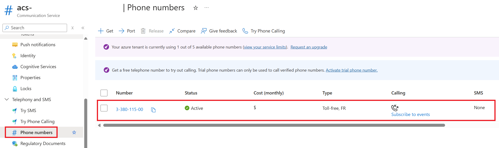

</details>

## Add the phone call method

### Update the backend server

The first step is to update the backend server to provide an endpoint to get the phone number you just bought. In a real world scenario, you can imaging having multiple phone numbers by country and you would need to get the phone number dynamically.

<div class="task" data-title="Task">

> Implement the `getFirstPhoneNumber` method to get the phone number you just bought inside the `src/acs-to-external/back/svc/getPhoneNumber.js` folder.
> Use the `@azure/communication-phone-numbers` package to get the phone number.
> Test it with Postman by calling the `/phone` endpoint.

</div>

<div class="tip" data-title="Tips">

> This tutorial will help you to get started with the `@azure/communication-phone-numbers` package:
> [Azure Communication Services - Phone Numbers][acs-phone-numbers]

</div>

<details>
<summary>Toggle solution</summary>

The `getFirstPhoneNumber` method should look like this:

```javascript
export async function getFirstPhoneNumber() {
  const client = new PhoneNumbersClient(env["ACS_CONNECTION_STRING"]);
  const numbers = await client.listPurchasedPhoneNumbers();
  let firstNumber;
  for await (const number of numbers) {
    firstNumber = number;
    break;
  }
  if (!firstNumber) {
    throw new Error("No phone numbers available");
  }

  return firstNumber.phoneNumber;
}
```

You need to use a `PhoneNumbersClient` object to get the phone numbers you bought. You can then loop through the phone numbers and return the first one. In a real world scenario, you can imagine having multiple phone numbers and you would need to get the phone number dynamically based on the country code for instance.

Restart the backend server by running the following commands and test the endpoint:

```bash
cd src/acs-to-external/back

npm start
```

Call the `http://localhost:8080/phone` endpoint to test if you get the phone number you just bought.

</details>

### Update the frontend

Now that you have a phone number, you can create a call between your frontend application and this new endpoint.

You will continue to use the code inside the `src/acs-to-external/front/client.js` file.

<div class="task" data-title="Task">

> Implement the `startPhone` method to create a call between your frontend application and the phone number you just bought.
> Use the `getPhoneNumber` method to get the phone number you just bought.

</div>

<div class="tip" data-title="Tips">

> You can look at the `startCallOptions` interface to see how to start a call with a phone number
> [Azure Communication Services - StartCallOptions][acs-start-call-options]

</div>

<details>
<summary>Toggle solution</summary>

The `startPhone` method should look like this:

```javascript
async function startPhone(phoneNumber, callAgent, gui) {
  const callingNumber = await getPhoneNumber();
  console.log(`Calling from ${callingNumber} to ${phoneNumber}`);
  callAgent.startCall([{ phoneNumber }], {
    alternateCallerId: { phoneNumber: callingNumber },
  });
}
```

As you can see, the `startPhone` method takes a `phoneNumber` parameter, which should start with the country code for instance `+33` for France or `+1` for US, this is the phone number you will call.

By using the `getPhoneNumber` method to dynamically get the phone number you just bought in the Azure Communication Services resource.

</details>

### Test the phone call

You can now start the frontend again by running the following commands:

```bash
cd src/acs-to-external/front

npm start
```

Go back to `http://localhost:8081` in your browser, enter a phone number with the country code and click on the `Start Call` button. You should receive a call from the phone number you just bought.

The `Hang Up` button will stop the call because you already implemented in the `hangsUp` method which is the same for both types of calls.

[acs-phone-numbers]: https://learn.microsoft.com/en-us/azure/communication-services/quickstarts/telephony/get-phone-number?tabs=linux&pivots=programming-language-javascript#get-purchased-phone-numbers
[acs-start-call-options]: https://learn.microsoft.com/en-us/javascript/api/azure-communication-services/@azure/communication-calling/startcalloptions?view=azure-communication-services-js
[acs-send-message]: https://learn.microsoft.com/en-us/javascript/api/overview/azure/communication-chat-readme?view=azure-node-latest#send-a-message-to-the-thread

---

# Lab 4 - Map Azure Communication Services Users to your own users

In this lab, you will create a user mapping between your own users and the Azure Communication Services users. In fact, in a real world scenario, you will have to map your own users to an identifier of the Azure Communication Services. This is necessary if you want to be able to track the history of the calls, messages, etc.

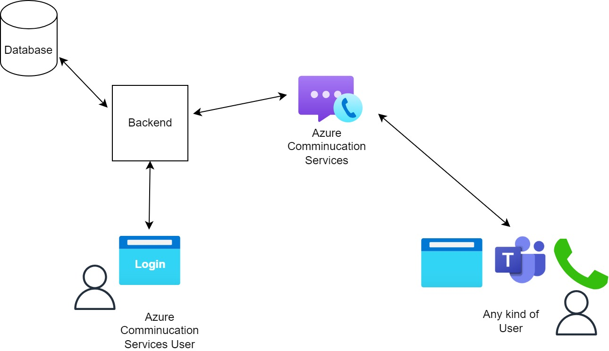

You will use a fake backend server with an in memory database to store the user mapping and simulate the user authentication. Most of the code is already done for you, you just need to implement the identification of the user.

## Create a user identification method

As you can see in the `src/acs-to-external/back/svc/identifyUser.js` file, you have a method called `identifyUser`.

<div class="task" data-title="Task">

> Implement the `identifyUser` method to identify the user and return the Azure Communication Services user identifier.
> Use the `backend` object to check if the `email` of the user is already in the database
> If it's not store, use the `createUserAndToken` method to create a user access token for chat and VOIP and store it in the database.
> Return the payload object defined in the method signature.

</div>

<details>
<summary>Toggle solution</summary>

The `identifyUser` method should look like this:

```javascript
export async function identifyUser(backend, email) {
  let exists = backend.has(email);
  const payload = { acsId: "", token: "default", created: !exists };

  if (!exists) {
    const { user, token } = await createUserAndToken(["chat", "voip"]);
    backend.set(email, { user, token });
  }

  const { user, token } = backend.get(email);
  payload.acsId = user.communicationUserId;
  payload.token = token;
  return payload;
}
```

Here's a step-by-step explanation of what the function does:
First, we check if the user exists, by checking if the email is already in the database. If it's not, we create a new user and token by calling the `createUserAndToken` method. We then store the user and token in the database. Finally, we return the payload object with the user's communication ID and token.

## Test the new endpoint

You can now start the backend server by running the following commands:

```bash
cd src/acs-to-external/back

npm start
```

You can now test the `/login` endpoint by calling it with the email of a user. You should receive a payload object with the user's communication ID and token.

You can test it directly:

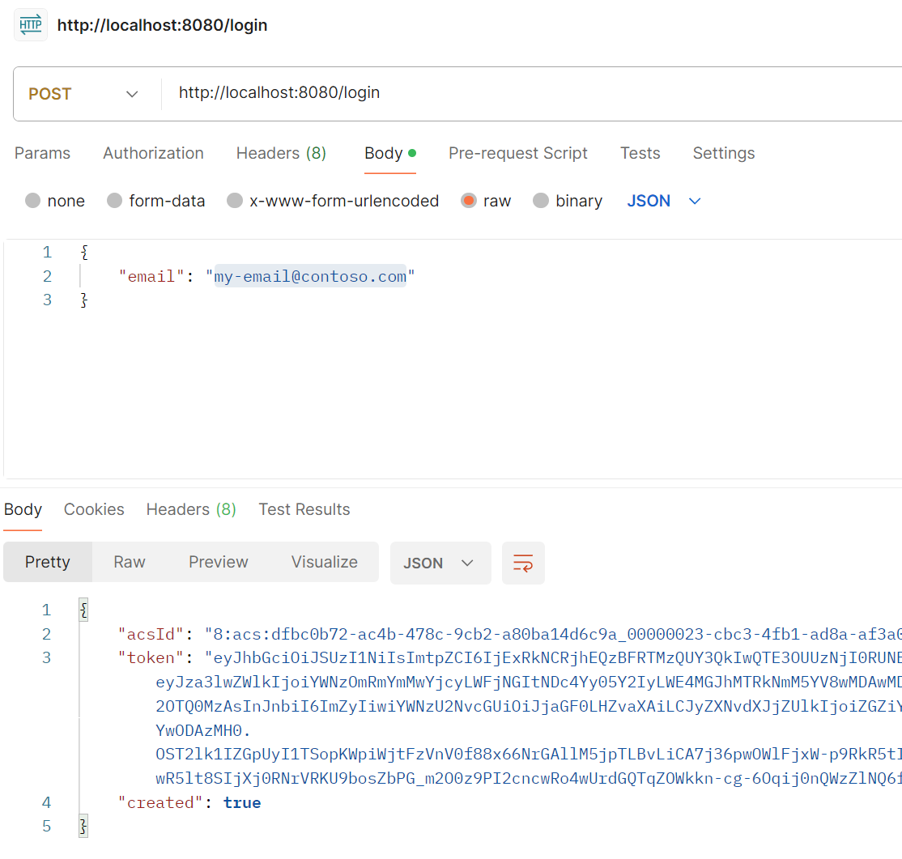

</details>

---

# Closing the workshop

Once you're done with this lab you can delete the resource group you created at the beginning.

To do so, click on `delete resource group` in the Azure Portal to delete all the resources and audio content at once. The following Az-Cli command can also be used to delete the resource group :

```bash
# Delete the resource group with all the resources
az group delete --name <resource-group>
```
